# Visualize Point Clouds
## Introduction to Point Cloud Processing
### How to create and visualize point clouds

“Point Cloud Processing” tutorial is beginner-friendly in which we will simply introduce the point cloud processing pipeline from data preparation to data segmentation and classification.

In this tutorial, we will introduce point clouds and see how they can be created and visualized.

1. Introduction
Point cloud applications are everywhere: robotics, autonomous vehicles, assistance systems, healthcare, etc. A point cloud is a 3D representation suitable for processing real-world data, especially when the geometry of the scene/objects is required, such as the distance, the shape and the size of objects.

A point cloud is a set of points that represents the scene in the real world or objects in space. It is a discrete representation of geometric objects and scenes. More formally, a point cloud PCD is a set of n points where each point Pi is represented by its 3D coordinates :

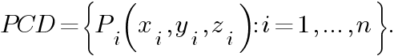

Note that some other features can be added to describe point clouds such as RGB colors, normals, etc. RGB colors, for example, can be added to provide color information.

2. Point cloud generation
Point clouds are typically generated using 3D scanners (laser scanners, time-of-flight scanners, and structured-light scanners) or from computer-aided design (CAD) models. In this tutorial, we will first create random point clouds and visualize them. Then we will generate it from 3D models by sampling points from the 3D surface using the Open3D library. Finally, we will see how they can be created from RGB-D data.

Let’s start by importing the libraries:

[import_libs](./import_libs.py)

Random point cloud
The easiest way is to create a point cloud randomly. Note that we don’t usually create random points to be processed, except to create noise for GANs (Generative Adversarial Networks) for example.

Generally, point clouds are represented by (n × 3) arrays where n is the number of points. Let’s create a point cloud with 5 random points:

[create_random_pcd](./create_random_pcd.py)

We can just print these points but it is not efficient especially if the number of points is large like in most applications. A better way is to display them in 3D space. Let’s visualize it using Matplotlib library:

[display_random_pcd](./display_random_pcd.py)

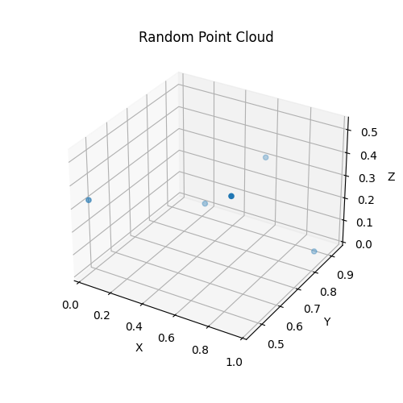

Sampled point cloud
Sometimes processing 3D models directly takes time and memory. Therefore, sampling point clouds from their 3D surfaces is a potential solution. Let’s import the bunny model from the Open3D dataset:

[import_mesh_o3d](./import_mesh_o3d.py)

Or import it after downloading it from this [link](http://graphics.im.ntu.edu.tw/~robin/courses/cg03/model/):

[import_ply_mesh](./import_ply_mesh.py)

Next, display the 3D model to see how it looks like. You can move the mouse to view from different view points.

[display_mesh](./display_mesh.py)

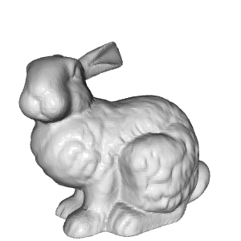

To sample a point cloud, several methods exist. In this example, we sample 1000 points uniformly from the imported mesh and visualize it:

[pcd_sampling](./pcd_sampling.py)

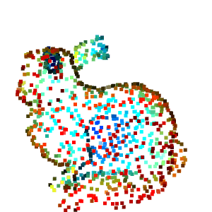

We can save the created point cloud in .ply format as follows:

[save_pcd_ply](./save_pcd_ply.py)

Point clouds from RGB-D data
RGB-D data is collected using RGB-D sensors (such as Microsoft Kinect) which simultaneously provide an RGB image and a depth image. RGB-D sensors are involved in many applications such as indoor navigation, obstacle avoidance, etc. As the RGB image provides the pixel color, each pixel of the depth image indicates its distance from the camera.

Open3D provides a set of functions for RGB-D image processing. To create point clouds from RGB-D data using Open3D functions just import the two images, create an RGB-D image object and finally compute the point cloud as follows:

[pointcloud_rgbd](./pointcloud_rgbd.py)

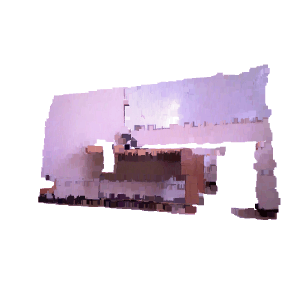

3. Open3D and NumPy
Sometimes you will need to switch between Open3D and NumPy representations. For example, let’s say we want to convert a NumPy point cloud to an Open3D.PointCloud object for visualization, and visualize the 3D model of bunny using Matplotlib.

From NumPy to Open3D
In this example, we create 2000 random points using NumPy.random.rand() function that creates random samples from a uniform distribution over [0,1[. Then we create an Open3D.PointCloud object and set its Open3D.PointCloud.points feature to the random points using Open3D.utility.Vector3dVector() function.

[numpy_open3d](./numpy_open3d.py)

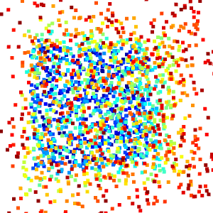

From Open3D to NumPy
Here, we first read the point cloud from a .ply file using Open3D.io.read_point_cloud() function that returns an Open3D.PointCloud object. After that, we only have to transform the Open3D.PointCloud.points feature that represents the points to a NumPy array using NumPy.asarray() function. Finally, we display the obtained array as we did above.

[open3d_numpy](./open3d_numpy.py)

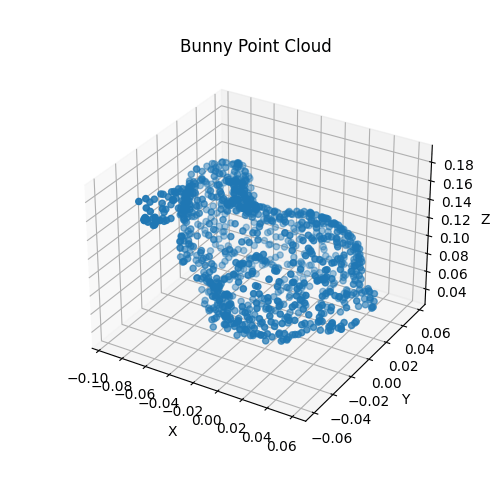

4. Conclusion
In this tutorial, we learned how to create and visualize point clouds.

## Estimate Point Clouds From Depth Images in Python
### Point Cloud Computing from RGB-D Images

In the previous tutorial, we introduced point clouds and showed how to create and visualize them. In this tutorial, we will learn how to compute point clouds from a depth image without using the Open 3D library. We will also show how the code can be optimized for better performance.

1. Depth Image
A depth image (also called a depth map) is an image where each pixel provides its distance value relative to the sensor’s coordinate system. Depth images can be captured by structured light or time-of-flight sensors. To compute depth data, structured light sensors, such as Microsoft Kinect V1, compare the distortion between projected and received light. As for time-of-flight sensors like Microsoft Kinect V2, they project light rays and then compute the time elapsed between the projection and the reception of these later.

In addition to the depth image, some sensors provide their corresponding RGB image to form an RGB-D image. The latter makes it possible to compute a colored point cloud. This tutorial will use the Microsoft Kinect V1 RGB-D image as an example.

Let’s start by importing the libraries:

[import_libs](./import_libs.py)

Now, we can import the depth image and print its resolution and its type:

[read_depth_image](./read_depth_image.py)

- Image resolution: (480, 640)
- Data type: int32
- Min value: 0
- Max value: 2980

The depth image is a matrix of size 640×480 where each pixel is a 32 (or 16) bit integer that represents the distance in millimeters and for this reason the depth image looks black when opened (see figure below). The min value 0 represents the noise (there is no distance) while the max value 2980 represents the distance of the farthest pixels.

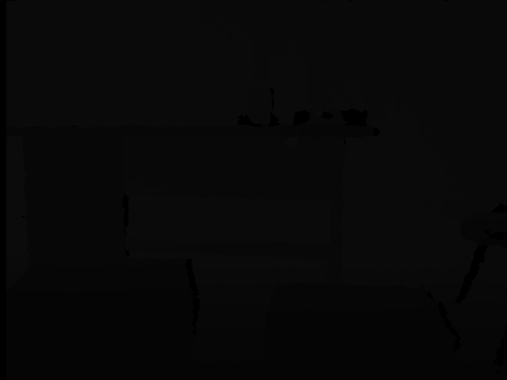

For a better visualization, we compute its grayscale image:

[depth_grayscale](./depth_grayscale.py)

Computing the grayscale image means scaling the depth values to [0, 255]. Now the image is clearer now:

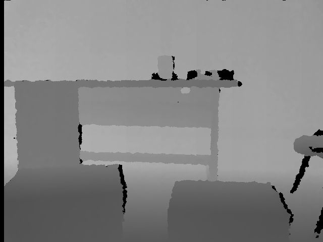

Note that, Matplotlib does the same thing when visualizing the depth image:

[display_depth_grayscale](./display_depth_grayscale.py)

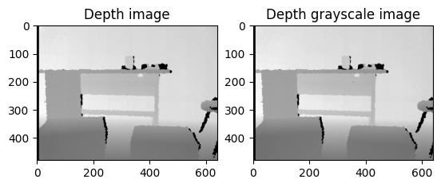

2. Point cloud
Now that we have imported and displayed the depth image, how can we estimate the point cloud from it? The first step is to calibrate the depth camera to estimate the camera matrix and then use it to compute the point cloud. The obtained point cloud is also called 2.5D point cloud since it is estimated from a 2D projection (depth image) instead of 3D sensors such as laser sensors.

Depth camera calibration
Calibrating a camera means estimating lens and sensor parameters by finding the distortion coefficients and the camera matrix also called the intrinsic parameters. In general, there are three methods for calibrating a camera : using the standard parameters provided by the factory, using the results obtained in calibration research or calibrating the Kinect manually. Calibrating the camera manually consists of applying one of the calibration algorithm such as the chess-board algorithm[1]. This algorithm is implemented in Robot Operating System (ROS) and OpenCV. The calibration matrix M is a 3×3 matrix:

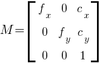

Where fx, fy and cx, cy are the focal length and the optical centers respectively. For this tutorial, we will use the obtained results of NYU Depth V2 dataset:

[depth_camera_matrix](./depth_camera_matrix.py)

If you want to calibrate the camera yourself you can refer to [this OpenCV tutorial](https://docs.opencv.org/4.6.0/dc/dbb/tutorial_py_calibration.html).

Point cloud computing
Computing point cloud here means transforming the depth pixel from the depth image 2D coordinate system to the depth camera 3D coordinate system (x, y and z). The 3D coordinates are computed using the following formulas [2], where depth(i, j) is the depth value at the row i and column j:

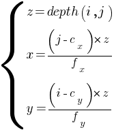

The formula is applied for each pixel:

[compute_pointcloud](./compute_pointcloud.py)

Let’s display it using Open3D library:

[display_pcd](./display_pcd.py)

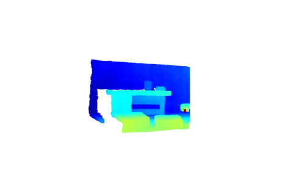

3. Colored point cloud
What if we want to compute the colored point cloud from an RGB-D image? The color information can enhance the performance of many tasks like point cloud registration. In this case, if the input sensor provides the RGB image too, it is preferable to use it. A colored point cloud can be defined as follows:

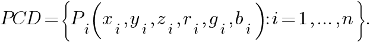

Where x, y and z are the 3D coordinates and r, g and b represent the color in the RGB system.

We start by importing the corresponding RGB image of the previous depth image:

[import_rgbd_image](./import_rgbd_image.py)

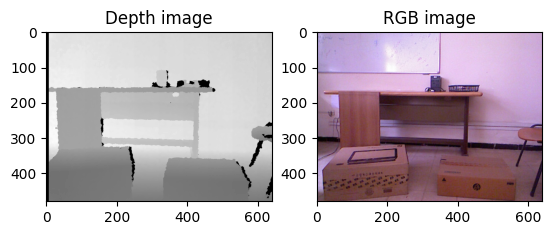

To find the color of a given point p(x, y,z) that is defined in the depth sensor 3D coordinate system:

1. We transform it to the RGB camera coordinate system [2]:

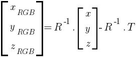

Where R and T are the extrinsic parameters between the two cameras: the rotation matrix and the translation vector respectively.

Similarly, we use the parameters from [NYU Depth V2 dataset](https://cs.nyu.edu/~silberman/datasets/nyu_depth_v2.html):

[rotation_matrix_translation_vector](./rotation_matrix_translation_vector.py)

The point in the RGB camera coordinate system is computed as follows:

[from_depth_to_rgb_camera](./from_depth_to_rgb_camera.py)

2. Using the intrinsic parameters of the RGB camera, we map it to color image coordinate system [2]:

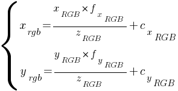

These are the indices to get the color pixel.

Note that in the previous formulas, the focal length and the optical centers are the RGB camera parameters. Similarly, we use the parameters from [NYU Depth V2 dataset](https://cs.nyu.edu/~silberman/datasets/nyu_depth_v2.html):

[rgb_camera_matrix](./rgb_camera_matrix.py)

The indices of the corresponding pixel is computed as follows:

[from_rgb_camera_to_rgb_image](./from_rgb_camera_to_rgb_image.py)

Let’s put all together and display the point cloud:

[colored_point_cloud](./colored_point_cloud.py)

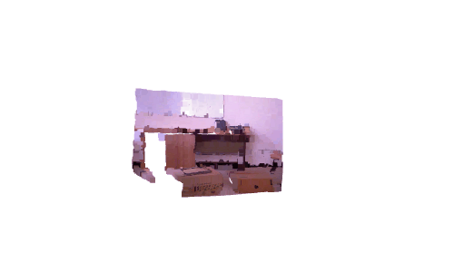

4. Code optimization
In this section, we explain how to optimize your code to be more efficient and suitable for real-time applications.

Point cloud
Computing point clouds using nested loops is time consuming. For a depth image with 480×640 as resolution, on a machine having 8GB RAM and an i7–4500 CPU, computing the point cloud took about 2.154 seconds.

To reduce the computation time, nested loops can be replaced by vectorisation operations and the computation time can be reduced to about 0.024 seconds:

[pcd_computing_vectorisation](./pcd_computing_vectorisation.py)

We can also reduce the computation time to about 0.015 seconds by computing the constant once at the beginning:

[pcd_optimisation](./pcd_optimisation.py)

Colored point cloud
As for the colored point cloud, on the same machine, executing the previous example took about 36.263 seconds. By applying vectorisation, the running time is reduced down to 0.722 seconds.

[colored_pcd_optimisation](./colored_pcd_optimisation.py)

5. Conclusion
In this tutorial, we learned how to compute point clouds from RGB-D data.

## Understand Point Clouds: Implement Ground Detection Using Python
### Ground Detection Algorithm

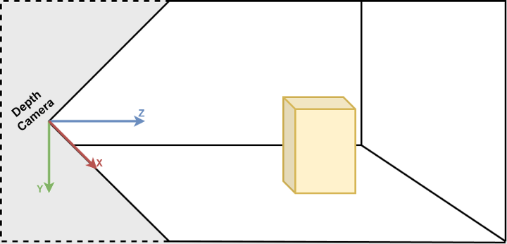

In the previous tutorial, we computed point clouds from depth data without using Open3D library. In this tutorial, we will first describe the system coordinate. Then, we will closely analyze the point clouds by taking the ground detection as an example. We will also introduce organised point clouds which is an interesting 3D representation.

1. Computer vision coordinates systems
Before starting, it is important to understand the conventional coordinate systems in computer vision. They are followed in Open3D [1] and Microsoft Kinect sensors[2]. In computer vision, an image is represented in an independent 2D coordinate system where X-axis points from left to right and Y-axis points from top to bottom. As for cameras, the 3D coordinate system origin is located at the focal point of the camera where the X-axis points right, the Y-axis points down and Z-axis points forward.

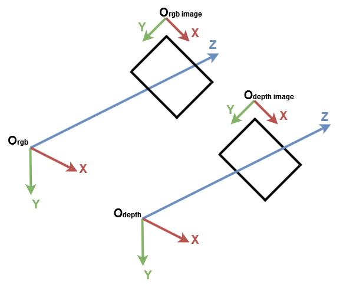

[import_libs](./import_libs.py)

For a better understanding, let’s import a point cloud from a PLY file, create a default 3D coordinate system using Open3D and display them:

[draw_geometries](./draw_geometries.py)

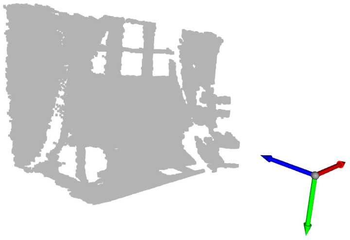

Knowing that the blue, the red and the green arrows represent the Z-axis, the X-axis and the Y-axis respectively, you can see that the point cloud is represented in the same coordinate system as the Open3D coordinate system. Now, let’s get points having minimum and maximum values of each axis:

[get_max_min](./get_max_min.py)

We can print them but for a better visualization, we create a sphere geometry in each point position. By default, Open3D create the 3D geometry at the origin position:

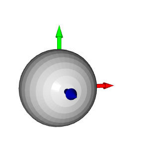

To move the sphere to a given position, a translation transformation is required. In the example below the sphere is translated by the vector [1,1,1]:

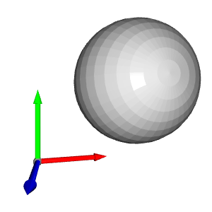

Let’s go back to our example and assign each sphere a color. For each position, we create a sphere and translate it to that position. Then, we assign the right color and finally we add it to to display at the end.

[draw_spheres](./draw_spheres.py)

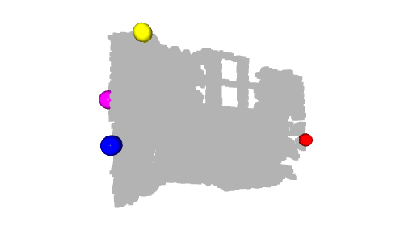

Hmm, we can see that the yellow sphere that corresponds to y_min is on the wall and the green sphere that corresponds to y_max is on the ground. Indeed, the Y-axis represents the height of the points: in the real world, the highest sphere is the yellow one and the lowest sphere is the green one. However, since the Y-axis points down, the yellow sphere has the minimum value and the green sphere has the maximum value.

Another interesting sphere is the cyan sphere which is on the origin. As we mentioned in the previous tutorial, the pixels having 0 as depth value are noise points, hence the points located at the origin are the points computed from these noise pixels (when z=0 then x=0 and y=0).

2. Ground Detection
Now that we displayed some important points, how can the ground be detected? In the previous example, the green sphere is on the ground. To be exact, its center that corresponds to the highest point along the Y-axis is a ground point. Let’s say that in order to detect the ground, we change the color of all the points that have y_max to the green color.

If you display the point cloud, you will notice that not all the ground points are in green. In fact, only one point that corresponds to the center of the previous green sphere is in green. This is due to the accuracy and noise level of the depth camera.

To overcome this limitation, we need to add a threshold so points that have the y coordinate in [y_max-threshold, y_max] are all considered as ground points. To do so, after getting y_max , we check for each point if its y coordinate is in that interval then, we set its color to green. Finally we update the colors attribute of the point cloud and display the result.

[ground_detection](./ground_detection.py)

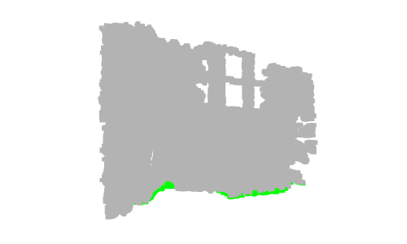

In this example, we only colored the points that represent the ground in green. In real-world applications, the ground is extracted to define the walkable area like in robotics or visually impaired systems or to put objects on it like in interior design systems. It can also be removed, so the remaining points can be segmented or classified like in scene understanding and object detection systems.

3. Organised point cloud
In our first tutorial, we defined a point cloud as a set of 3D points. A set is an unordered structure so the point cloud represented by a set is called an unorganized point cloud. Similar to an RGB matrix, an organized point cloud is a 2D matrix with 3 channels representing the x-, y-, and z- coordinates of the points. The matrix structure provides the relationship between adjacent points and thus reduces the temporal complexity of some algorithms like nearest neighbors.

Let’s say, as an example, that we are writing a research paper and we want to show the result of our ground detection algorithm as a figure. Unfortunately, an animated figure cannot be chosen. Therefore, we can either take a screenshot of the point cloud or display the result on the depth image as shown in the figure below. In my opinion, the 2nd option is the best. In this case, an organized point cloud is needed to preserve the location of the depth pixel.

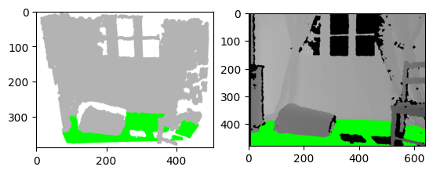

Let’s create an organized point cloud from the previous depth image. We first, import the camera parameters as we did in the previous article. We also, import the depth image and convert it to a 3-channel grayscale image so we can set to the ground pixels to green:

[import_input](./import_input.py)

To compute an organised point cloud, we proceed the same way as we did in the previous tutorial. Instead of flattening the depth image, we reshape jj and ii to have the same shape as the depth image as follows:

[organised_pointcloud](./organised_pointcloud.py)

If you print the shape of the created point cloud you can see that it is matrix with 3 channels (480, 640, 3). If you find this code hard to understand please go back to the previous tutorial and if it is still not clear do not hesitate to leave me your questions I will be happy to help you.

Similarly, we detect the ground as we did above but instead of updating the color of the points and displaying the point cloud, we update the pixel of the grayscale image and we display it:

[ground_detection_organised_pointcloud](./ground_detection_organised_pointcloud.py)

4. Conclusion
In this tutorial and in order to get used to point clouds, we introduced the default coordinate system and we implemented a simple ground detection algorithm. Indeed ground detection is an important task in certain applications such as navigation and several algorithms have been proposed in the literature. The implemented algorithm is simple; it considers the lowest points as the ground. However, its limitation is the fact that the depth camera must be parallel to the ground which is not the case with most real-world applications.

Now it’s your turn, try to detect the closest objects (which are not the ground) and give them the color red for example. In the next tutorial, we will learn how to pre-process point clouds to reduce noise for example.

## Point Cloud Filtering in Python
### Point cloud pre-processing using Open3D

We will learn how to filter point clouds for down-sampling and outlier removal in python using Open 3D.

1. Introduction
The computed or the gathered point clouds can sometimes be noisy due to the nature of the used 3D scanners (such as structured-light scanners) or the captured scene (includes materials that absorb infrared lights). On the other hand, some algorithms and/or computer vision techniques are sensitive to noise like estimating surface normals and curvature changes.

In order to reduce noise, filtering techniques are used. Some filters are also used to reduce the point cloud density and thus reduce the computation time. In this article, we’re going to see some common filters, namely: pass-through filter, statistical outlier removal filter, radius outlier removal filter and down-sampling filters.

2. Pass-through filter
The Pass-through filter applies constraints on the input data which are usually thresholds or intervals. For point clouds, a point passes through the filter if it satisfies the constraints which are mostly intervals along one or more axes. To reduce noise, the interval is generally fixed according to the nature and the state of the input device: the depth data is more accurate inside the interval and becomes more noisy otherwise. The pass-through filter can be used not only for filtering the input from noise, but also to reduce data such as considering the nearest points.

Up to version 0.7.0, Open3D supports the function crop_point_cloud(input, min_bound, max_bound) where [1]:

- input is the input point cloud.

- min_bound is the minimum bound for point coordinates.

- max_bound is the maximum bound for point coordinates.

- returns a point cloud of points that are inside the intervals.

For example, to filter a point cloud to reduce noise along the Z-axis by considering the interval [0.8, 3] . For the X and Y axes, we set the bounds to infinity since we’re not filtering along them:

[crop_point_cloud](./crop_point_cloud.py)

After the version 0.7.0, to crop a point cloud the method crop(bounding_box) of open3d.geometry.PointCloud can be used. Similarly to the previous function, this method returns the cropped point cloud. To do this, we first create a bounding box that encloses the points that will be considered. This bounding box is created from the combination of the intervals’ bounds (see bounding_box_points ). Here, we only filter along the Z-axis: only the points that their z-coordinate is between [0.8, 2] are returned. Finally, the input point cloud is cropped using the created bounding box object:

[crop_point_cloud](./crop_point_cloud.py)

The resulting point cloud looks like:

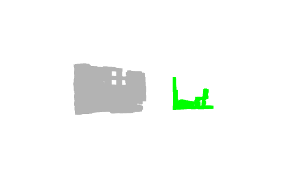

- Gray: the input point cloud. Green: the resulting point cloud.

3. Down-sampling
Down-sampling point clouds consist of reducing the number of points. It’s generally applied to reduce the running time of the processing step or to select an exact number of points for training for example.

The Open3D library provides three different approaches to down sample points clouds:

random_down_sample(pcd, sampling_ratio) : selects n*sampling_ratio random points from the input point cloud pcd . It can be used for data augmentation since different points are selected each time. However, it’s sensitive to noise: it can be selected.
uniform_down_sample(every_k_points) : selects points uniformly regarding their order. It selects a point every every_k_points points. The first point (having the indice 0) is always selected. The indices of selected points are thus: 0, every_k_points , 2 *every_k_points , etc. If the input point cloud is organized, the function returns a uniform point cloud; else, it is similar to the first approach except it generates the same output each time.
voxel_down_sample(voxel_size) : creates a 3D voxel grid. The voxel grid divides the input into a set of voxel_size×voxel_size×voxel_size voxels. Each voxel includes the points that belong to the same intervals regarding the 3 axes. The points belonging to the same voxel are then down-sampled and replaced with their centroid. This filter is used to reduce the point cloud’s size and to smooth it. However, it is time consuming since it computes the centroids after reorganizing the point cloud into voxel, and it is sensitive to outliers.
Now, let’s test all these methods and display the resulting point clouds. For a better visualization, we set sampling_ratio to 0.005 , every_k_points to 200 and voxel_size to 0.4 for random_down_sample , uniform_down_sample and voxel_down_sample respectively. Finally, we apply translation to display all the point clouds separately and in the same window.

[point_cloud_downsampling](./point_cloud_downsampling.py)

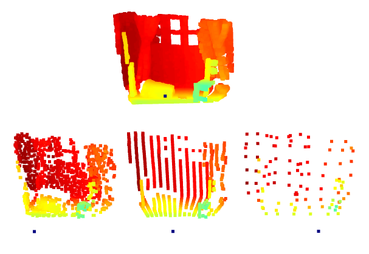

- Organized point cloud down-sampling. Top: the input point cloud. Down, from left to right: random down-sampling, uniform down-sampling and voxel based down-sampling.

Note that the resulting point cloud of the uniform_down_sample method is uniformly distributed in the 3D space. This is because the input is an organized point cloud (the points are organized in the list).

Let’s create an unorganized point cloud by shuffling the points of the previous point cloud as follows:

[unorganized_pcd](./unorganized_pcd.py)

Then similarly to the previous example, we apply the different down-sampling methods on u_pcd and display the results. The visualization window looks like:

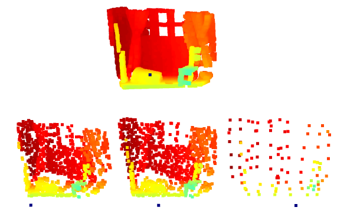

- Unorganized point cloud down-sampling. Top: the input point cloud. Down, from left to right: random down-sampling, uniform down-sampling and voxel based down-sampling.

Here, the resulting point cloud of the uniform_down_sample method is not uniformly distributed in the 3D space. It looks more like a random down-sampling because the points are unorganized. However, the voxel_down_sample returns the same point cloud since it reorganizes the points into a 3D grid.

4. Outlier removal filters
Radius outlier removal is a conditional filter that removes every point that has less than a given number of neighbors within a sphere of a given radius. Open3D provides the method remove_radius_outlier(nb_points, radius) where:

- nb_points is the number of neighbors.

- radius is the sphere radius.

- returns: a tuple of the filtered point cloud and a list of the inliers indices.

Statistical outlier removal filter removes points that are further away from their neighbors. For each point the mean distance from it to all its neighbors is computed. Then, if the mean distance of the point is outside an interval defined by the global distances mean and standard deviation then the point is an outlier. Open3D provides the method remove_statistical_outliers(nb_neighbors, std_ratio) where [2]:

- nb_neighbors is the number of neighbors.

- std_ratio is the standard deviation ratio.

- returns: a tuple of the filtered point cloud and a list of the inliers indices.

Let’s test these two methods and display the resulting point clouds. To reduce the running time,we first apply a down-sampling. After applying outlier removal filters, we select by index the points that are outliers using select_by_index(index, invert) . We set invert to True to invert the selection of indices.

[point_cloud_outlier_removal](./point_cloud_outlier_removal.py)

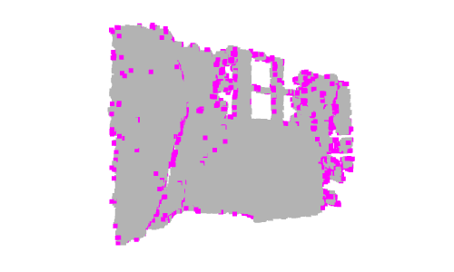

- Point cloud outlier removal. Left: radius filter. Right: statistical filter.

5. Conclusion
To this end, we introduced the most known point cloud filters. These filters are implemented in Open 3D. They are also implemented in some other point cloud libraries such as PCL. Filtering and reducing the size of point clouds are required in most real-time applications especially with dense point clouds.
